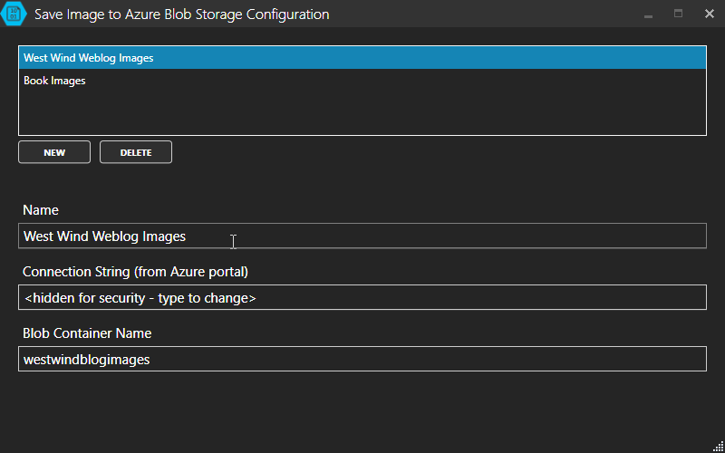

# Save To Azure Blob Storage Markdown Monster Add-in

This project provides a [Markdown Monster](https://markdownmonster.west-wind.com) Add-in for saving images opened from a file or from the clipboard and posting them to a Blob in Azure Blob Storage. 

Images are previewed and can then be pushed to Azure Storage with the resulting URL automatically getting embedded into the open Markdown document.

### How it works
The add-in allows you to select images off the file system or from the clipboard, which can then be posted to an Azure Blob container. The add-in  uploads the file to blob storage and then captures the new blob's URL which is then embedded into the document.

Here's a animated gif that shows the workflow:


### Images from Clipboard Optimizations
If an image exists on the clipboard when the add-in is started, it's immediately loaded. 

If no image is selected and you move away and copy an image to the clipboard, the image is automatically pasted into the preview when you activate the add in window.

Otherwise you can use the **Paste Image** button or **Control-V** to paste images from the clipboard.

### Installation
Currently add-ins have to be manually installed into Markdown Monster - we'll have an automated registry soon, but for now...

 1. Download the  [addin.zip](https://github.com/RickStrahl/SaveToAzureBlob-MarkdownMonster-Addin/blob/master/Build/addin.zip) from the `Build` folder
 1. Right-click the ZIP file, go to properties and Unblock
 1. Unzip and copy all of the contents to **c:\Program Files\Markdown Monster\Addins**, but do not overwrite files if prompted

### Configuration
To configure this addin you need to setup connections to Azure which you can do via the Configuration dialog. You can access this dialog from the dropdown button next to the addin icon, or from the gear icon next to the connections in the main dialog.

Here's what the config dialog looks like.



You need to specify:

#### Name
This is the display name for the connection, and what shows in the list.

#### ConnectionString
This is the actual Azure connection string to connect to your BlobStorage account. You can get the connection string from the portal.

**Example:**   
DefaultEndpointsProtocol=https;AccountName=wwblob;AccountKey=yt0tsCf9scBJlBepmyj7eyzW/7LpYPN7dDMRm215x4R0ng0+TVlDxWXyqHr3ob4vrLFSPloOh03pezg6WsnQ==

#### ContainerName
This is the name Azure Blob Container that you want to store images to. This container has to exist before you can post images to it.

on:

```json
{
  "ConnectionStrings": [
    {
      "Name": "West Wind Weblog Images",
      "ConnectionString": "<encryptedstring>",
      "ContainerName": "westwindblogimages"
    },
    {
      "Name": "Book Images",
      "ConnectionString": "<encryptedstring>",
      "ContainerName": "bookimages"
    },
  ]
}
```

You can create multiple connections and the connections will show in the list on the toolbar to choose from. After adding the configuration for your container you will need to restart Markdown Monster.