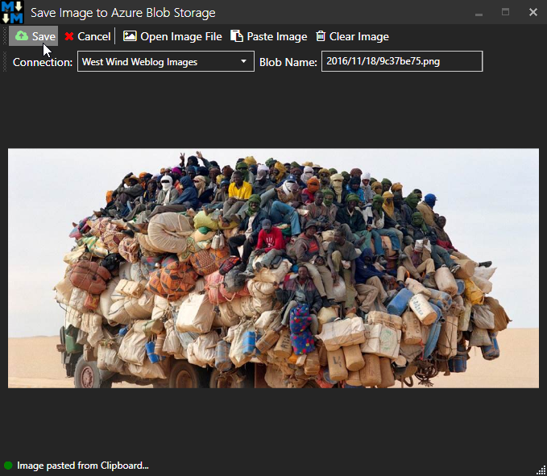
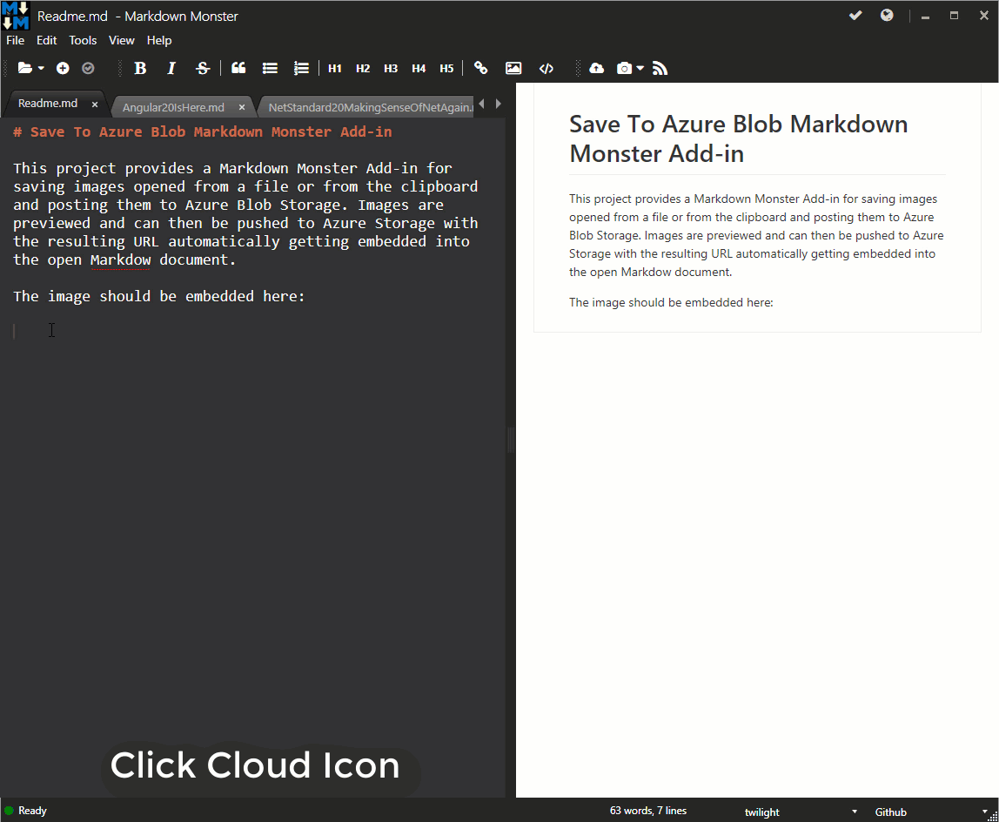

# Save To Azure Blob Storage Markdown Monster Add-in

This project provides a [Markdown Monster](https://markdownmonster.west-wind.com) Add-in for saving images opened from a file or from the clipboard and posting them to a Blob in Azure Blob Storage. 

Images are previewed and can then be pushed to Azure Storage with the resulting URL automatically getting embedded into the open Markdown document.



> #### Early pre-release
> This version is a pre-release version so installation and configuration is manual for now. Please see instructions below.


### How it works
The add-in allows you to select images off the file system or from the clipboard, which can then be posted to an Azure Blob container. The add-in  uploads the file to blob storage and then captures the new blob's URL which is then embedded into the document.

Here's a animated gif that shows the workflow:



### Images from Clipboard Optimizations
If an image exists on the clipboard when the add-in is started, it's immediately loaded. 

If no image is selected and you move away and copy an image to the clipboard, the image is automatically pasted into the preview when you activate the add in window.

Otherwise you can use the **Paste Image** button or **Control-V** to paste images from the clipboard.

### Installation
Currently add-ins have to be manually installed into Markdown Monster - we'll have an automated registry soon, but for now...

Download the  [SaveImageToAzureBlob-MarkdownMonster-Addin.zip](https://github.com/RickStrahl/SaveToAzureBlob-MarkdownMonster-Addin/raw/master/Build/SaveImageToAzureBlob-MarkdownMonster-Addin.zip) in the `Build` folder and copy it to:

**c:\Program Files\Markdown Monster\Addins**

### Configuration
In order to post to Azure you'll need to have a Blob Container pre-configured on your Azure account. Once that's in place for now you need to manually provide the configuration in the following location:


* Create `%AppData%\Markdown Monster\SaveToAzureBlobStorageAddin.josn`
* Create the following configuration:

```json
{
  "ConnectionStrings": [
    {
      "Name": "West Wind Weblog Images",
      "ConnectionString": "DefaultEndpointsProtocol=https;AccountName=westwindblobs;AccountKey=bl12f3sP8RcBJslBepmyj7eyzW/7LpYPN7dDMRm215x4R0ng0+TVlDxWXyqHr3ob4vrLFSPloOh03pezg6WsnQ==",
      "ContainerName": "westwindblogimages"
    }
  ]
}
```

You can create multiple connections and the connections will show in the list on the toolbar to choose from.

#### Name
This is the display name for the connection, and what shows in the list.

#### ConnectionString
This is the actual Azure connection string to connect to your BlobStorage account. You can get the connection string from the portal.

> #### Insecure!
> Note for now the connection string is not encrypted. Until a UI for configuration is added the string has to be edited manually as plain text in the config file.


#### ContainerName
This is the name Azure Blob Container that you want to store images to. This container has to exist before you can post images to it.


